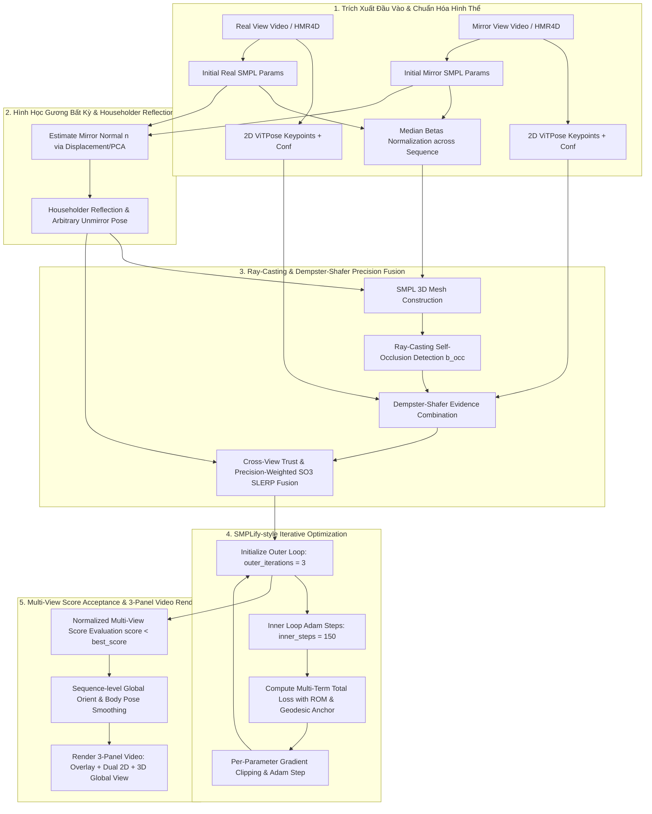

# BÁO CÁO CHI TIẾT: LÝ THUYẾT, KIẾN TRÚC MÔ HÌNH VÀ PHƯƠNG PHÁP TRIỂN KHAI

## Dự Án Optimization Mirror Human (3D Pose & Mesh Fusion from Real + Mirror Views)

> **Tài liệu đặc tả kiến trúc và lý thuyết toán học mới nhất của dự án.**
> Nguồn sự thật cài đặt: `configs/default.yaml`, `utils/belief_fusion.py` và `utils/pose_refit.py`.

---

## 1. MỤC TIÊU VÀ BỐI CẢNH DỰ ÁN

### 1.1. Thách Thức Trong 3D Human Mesh Recovery (HMR)

Trong các bài toán khôi phục lưới cơ thể 3D (3D Human Mesh Recovery) từ video đơn hướng (monocular video), các mô hình deep learning (như HMR4D, Cliff, SPM,...) thường gặp 4 hạn chế nghiêm trọng:

1. **Mơ hồ chiều sâu (Depth Ambiguity) & Che khuất (Self-Occlusion):** Khi một phần cơ thể (ví dụ tay hoặc chân) bị che khuất bởi thân người (đặc biệt khi quay lưng về camera), detector 2D/3D dễ đoán sai hoặc bị "nảy" pose 3D.
2. **Bẻ gãy khung xương (Anatomical Distortion):** Tối ưu hóa reprojection 2D thuần túy dễ đè đè các giới hạn vận động sinh lý (Range of Motion - ROM), dẫn đến gối gập ngược, xoắn cột sống cực đoan, gãy cổ tay hay vai vặn ra sau.
3. **Hiện tượng giật lắc khung hình (Temporal Jitter/Flickering):** Các frame được ước lượng độc lập khiến các khớp bị xoay/nảy liên tục giữa các frame kề nhau.
4. **Hiện tượng Vòng lặp tự tham chiếu của Belief (Self-Referential Belief Loop):** Khi Ray-casting được tính trên chính Mesh 3D đã đoán sai, tia ray không bị cản khiến $b_{\text{occ}} = 1$. Kết hợp với 2D confidence cao kéo $Belief_{\text{real}} \to 1.0$, dập tắt hoàn toàn thông tin đúng từ góc nhìn Gương.

### 1.2. Giải Pháp Cốt Lõi Của Dự Án

Dự án xây dựng một pipeline **Self-Supervised Optimization** (tối ưu hóa trực tiếp trên tham số mô hình cơ thể SMPL cho từng chuỗi video mà không cần huấn luyện lại mô hình học sâu):

* **Gương là góc nhìn bổ sung (Supplementary View):** Khai thác thông tin từ ảnh gương để bù đắp các khớp bị che khuất ở góc nhìn chính (Real View).
* **Phản xạ Householder Gương Bất Kỳ (Arbitrary Mirror Geometry):** Ước lượng tự động pháp tuyến mặt phẳng gương $\mathbf{n}$ từ dữ liệu và áp dụng ma trận phản xạ Householder $R_{\text{mirror}} = I - 2\mathbf{n}\mathbf{n}^T$ cho biến đổi Axis-Angle.
* **Lý thuyết niềm tin Dempster-Shafer (DST):** Kết hợp bằng chứng cứng từ Ray-Casting Occlusion với bằng chứng mềm từ ViTPose 2D detector và Geman-McClure reprojection consistency, cung cấp cơ chế phủ quyết (veto) khi occluded.
* **Cơ chế Cross-View Trust & Precision SLERP Fusion:** Phá vỡ vòng lặp tự tham chiếu bằng cách dùng độ tin cậy ViTPose 2D độc lập làm trọng tài khi 2 view bất đồng góc xoay, thực hiện hòa trộn SLERP trên nhóm Lie $SO(3)$ cho cả 21 khớp body pose và root orientation.
* **Ràng buộc Sinh lý Học & Score Acceptance:** Siết chặt các hàm phạt góc xoay giới hạn giải phẫu (`w_spine_twist`, `w_shoulder_hyper`, `w_wrist_bend`, `w_hip_split`) và đánh giá chấp nhận chuỗi bằng điểm số multi-view score đã chuẩn hóa (`score < best_score`).

---

## 2. KIẾN TRÚC TỔNG QUAN VÀ LUỒNG XỬ LÝ (PIPELINE ARCHITECTURE)



---

## 3. MÔ HÌNH HÌNH HỌC & HỆ TỌA ĐỘ VỚI GƯƠNG BẤT KỲ

### 3.1. Mô Hình Tham Số Cơ Thể SMPL

Mô hình **SMPL** (Skinned Multi-Person Linear Model) biểu diễn bề mặt cơ thể 3D $M(\boldsymbol{\beta}, \boldsymbol{\theta}, \mathbf{\gamma})$ với $N_v = 6890$ đỉnh và $K = 23$ khớp:

$$
\mathbf{T}_p(\boldsymbol{\beta}, \boldsymbol{\theta}) = \bar{\mathbf{T}} + B_S(\boldsymbol{\beta}) + B_P(\boldsymbol{\theta})
$$

$$
M(\boldsymbol{\beta}, \boldsymbol{\theta}, \mathbf{\gamma}) = W\left(\mathbf{T}_p(\boldsymbol{\beta}, \boldsymbol{\theta}), J(\boldsymbol{\beta}), \boldsymbol{\theta}, \mathbf{W}\right) + \mathbf{\gamma}
$$

Trong đó:

* $\bar{\mathbf{T}} \in \mathbb{R}^{6890 \times 3}$: Mesh cơ sở chuẩn (Rest pose).
* $\boldsymbol{\beta} \in \mathbb{R}^{10}$: Vector hình thể (Shape Betas). Giá trị trung vị $\boldsymbol{\beta}_{\text{fixed}} = \text{median}_{t=1}^T (\boldsymbol{\beta}_t)$ được cố định cho toàn chuỗi thời gian ([utils/beta_utils.py](file:///d:/optimization_mirror_human/utils/beta_utils.py)).
* $\boldsymbol{\theta} \in \mathbb{R}^{3 \times 24}$: Vector tư thế (Pose Parameters) dạng Axis-Angle $\mathbf{\omega} \in \mathbb{R}^3$, gồm 1 khớp gốc ($\boldsymbol{\theta}_{\text{root}}$) và 23 khớp cơ thể.
* $\mathbf{\gamma} \in \mathbb{R}^3$: Dịch chuyển 3D tổng thể (Global Translation).

### 3.2. Phản Xạ Householder Cho Gương Ở Vị Trí Bất Kỳ ([utils/mirror_geometry.py](file:///d:/optimization_mirror_human/utils/mirror_geometry.py))

Định nghĩa ma trận phản xạ Householder $R_{\text{mirror}} \in \mathbb{R}^{3 \times 3}$ với pháp tuyến mặt phẳng gương $\mathbf{n} \in \mathbb{R}^3$ ($\|\mathbf{n}\|_2 = 1$):

$$
R_{\text{mirror}} = I - 2 \mathbf{n} \mathbf{n}^T
$$

Biến đổi Axis-Angle $\mathbf{\omega} \in \mathbb{R}^3$ dưới gương bất kỳ:

$$
\mathbf{\omega}' = -R_{\text{mirror}} \mathbf{\omega} = -( \mathbf{\omega} - 2(\mathbf{\omega} \cdot \mathbf{n})\mathbf{n} )
$$

---

## 4. TỰ CHE KHUẤT VÀ LÝ THUYẾT NIỀM TIN DEMPSTER-SHAFER (BELIEF FUSION)

### 4.1. Bắn Tia Phát Hiện Tự Che Khuất (Ray-Casting Occlusion - [utils/mesh_raycast.py](file:///d:/optimization_mirror_human/utils/mesh_raycast.py))

Tại mỗi view, một tia ray được bắn từ tâm camera $\mathbf{C} = (0,0,0)^T$ tới từng khớp 3D $\mathbf{J}_j$:

$$
\mathbf{r}_j(s) = \mathbf{C} + s \cdot \frac{\mathbf{J}_j - \mathbf{C}}{\|\mathbf{J}_j - \mathbf{C}\|_2}, \quad s \in [0, \|\mathbf{J}_j - \mathbf{C}\|_2]
$$

Nếu tồn tại mặt tam giác $\mathbf{f}_k$ trên mesh đâm cắt tia ray tại $s_{\text{intersect}} \in (\epsilon_{\text{near}}, 0.985 \cdot \|\mathbf{J}_j - \mathbf{C}\|_2)$, khớp $j$ bị coi là occluded:

$$
b_{\text{occ}}^{(j)} = \begin{cases} 0 & \text{nếu bị che khuất (Occluded)} \\ 1 & \text{nếu nhìn thấy rõ (Visible)} \end{cases}
$$

### 4.2. Lý Thuyết Niềm Tin Dempster-Shafer ([utils/belief_fusion.py](file:///d:/optimization_mirror_human/utils/belief_fusion.py))

Khung nhận thức: $\Omega = \{\text{Present}, \text{Absent}\}$. Khối lượng niềm tin (mass $m$) được gán cho 3 nguồn bằng chứng:

1. **Ray-Casting Occlusion ($b_{\text{occ}}$):** Bằng chứng hình học cứng ($r_{\text{occ}} = 0.999$):
   $$
   m_{\text{occ}}(\{\text{Present}\}) = r_{\text{occ}} b_{\text{occ}}, \quad m_{\text{occ}}(\{\text{Absent}\}) = r_{\text{occ}} (1 - b_{\text{occ}})
   $$
2. **2D Detector Confidence ($b_{\text{det}}$):** Bằng chứng mềm từ ViTPose ($r_{\text{soft}} = 0.5$):
   $$
   m_{\text{det}}(\{\text{Present}\}) = r_{\text{soft}} b_{\text{det}}, \quad m_{\text{det}}(\{\text{Absent}\}) = 0
   $$
3. **2D Reprojection Consistency ($b_{\text{reproj}}$):** Nhân Geman-McClure ($\sigma = 50$px):
   $$
   b_{\text{reproj}} = \frac{\sigma^2}{\|\mathbf{x}_{2D}^{\text{proj}} - \mathbf{x}_{2D}^{\text{det}}\|^2 + \sigma^2}, \quad m_{\text{reproj}}(\{\text{Present}\}) = r_{\text{soft}} b_{\text{reproj}}
   $$

#### Quy Tắc Phối Hợp Dempster (Dempster's Rule of Combination):

Hệ số xung đột $K$ giữa 2 nguồn mass $m_1, m_2$:

$$
K = m_1(\{\text{Present}\}) m_2(\{\text{Absent}\}) + m_1(\{\text{Absent}\}) m_2(\{\text{Present}\})
$$

$$
m_{12}(\{\text{Present}\}) = \frac{m_1(P) m_2(P) + m_1(P) m_2(U) + m_1(U) m_2(P)}{1 - K}
$$

### 4.3. Cross-View Trust & Precision SLERP Fusion

Khi hai view bị bất đồng góc xoay (`bp_quality` từ hàm `compute_angular_discrepancy_penalty` thấp), độ tin cậy ViTPose 2D độc lập được dùng làm trọng tài qua `compute_cross_view_trust` ([belief_fusion.py:L383](file:///d:/optimization_mirror_human/utils/belief_fusion.py#L383)):

$$
\text{trust}_{\text{real}} = \frac{b_{\text{det, real}}}{b_{\text{det, real}} + b_{\text{det, mirror}} + \epsilon}
$$

$$
\text{scale}_{\text{real}} = \text{bp\_quality} + (1 - \text{bp\_quality}) \cdot \text{trust}_{\text{real}}
$$

Hòa trộn SLERP trên Quaternion cho cả 21 khớp body_pose và root orientation ([belief_fusion.py:L421-L460](file:///d:/optimization_mirror_human/utils/belief_fusion.py#L421-L460)):

$$
w_{\text{mirror}}^{(j)} = \frac{b_{\text{mirror}}^{(j)}}{b_{\text{real}}^{(j)} + b_{\text{mirror}}^{(j)} + \epsilon}
$$

$$
\mathbf{q}_{\text{fused}}^{(j)} = \text{SLERP}\left(\mathbf{q}_{\text{real}}^{(j)}, \mathbf{q}_{\text{mirror, unmirrored}}^{(j)}, w_{\text{mirror}}^{(j)}\right)
$$

$$
\mathbf{q}_{\text{fused}}^{\text{root}} = \text{SLERP}\left(\mathbf{q}_{\text{real}}^{\text{root}}, \mathbf{q}_{\text{mirror, unmirrored}}^{\text{root}}, w_{\text{mirror}}^{\text{root}}\right)
$$

---

## 5. CÁC HÀM LOSS VÀ NGUYÊN LÝ TỐI ƯU HÓA (REFIT OBJECTIVE)

### 5.1. Tổng Hàm Loss Đa Mục Tiêu ([utils/pose_refit.py](file:///d:/optimization_mirror_human/utils/pose_refit.py))

Quá trình refit tối ưu hóa tổng hàm loss $\mathcal{L}_{\text{total}}$:

$$
\begin{aligned}
\mathcal{L}_{\text{total}} = & \; w_{\text{reproj\_real}} \mathcal{L}_{\text{reproj, real}} + w_{\text{reproj\_mirror}} \mathcal{L}_{\text{reproj, mirror}} + w_{\text{pose\_prior}}(t) \mathcal{L}_{\text{pose\_prior}} \\
& + w_{\text{joint\_angle\_limit}} \mathcal{L}_{\text{ROM}} + w_{\text{anatomical}} \mathcal{L}_{\text{knee}} + w_{\text{elbow}} \mathcal{L}_{\text{elbow}} \\
& + w_{\text{spine\_twist}} \mathcal{L}_{\text{spine\_twist}} + w_{\text{hip\_split}} \mathcal{L}_{\text{hip\_split}} + w_{\text{shoulder\_hyper}} \mathcal{L}_{\text{shoulder\_hyper}} + w_{\text{wrist\_bend}} \mathcal{L}_{\text{wrist\_bend}} \\
& + w_{\text{temporal}} \mathcal{L}_{\text{pos\_accel}} + w_{\text{pose\_temporal}} \mathcal{L}_{\text{rot\_vel}} + w_{\text{pose\_accel}} \mathcal{L}_{\text{rot\_accel}} + w_{\text{anchor}} \mathcal{L}_{\text{anchor}}
\end{aligned}
$$

### 5.2. Công Thức Các Hàm Loss Sinh Lý Học  cg([losses/prior_losses.py](file:///d:/optimization_mirror_human/losses/prior_losses.py))

* **Robust 2D Reprojection Loss (Geman-McClure Kernel):**
  $$
  \mathcal{L}_{\text{reproj}, v} = \frac{\sum_{t=1}^T \sum_{j=1}^{17} b_{v, t}^{(j)} \cdot \mathbb{I}(z_{v,t,j} > 0) \cdot \frac{\|\mathbf{x}_{v, t, j}^{\text{proj}} - \mathbf{x}_{v, t, j}^{\text{det}}\|^2}{\|\mathbf{x}_{v, t, j}^{\text{proj}} - \mathbf{x}_{v, t, j}^{\text{det}}\|^2 + \sigma^2}}{\sum_{t=1}^T \sum_{j=1}^{17} b_{v, t}^{(j)} \cdot \mathbb{I}(z_{v,t,j} > 0) + \epsilon}
  $$
* **Spine Twist Limit ($w_{\text{spine\_twist}} = 0.5$):** Phạt xoắn cột sống trục Y $> 15^\circ$/đốt và tổng 3 đốt $> 25^\circ$:
  $$
  \mathcal{L}_{\text{spine\_twist}} = \frac{1}{T} \sum_{t=1}^T \left( \sum_{k \in \{2,5,8\}} \text{ReLU}(|\theta_{k, y, t}| - 0.26)^2 + \text{ReLU}\left(\left|\sum \theta_{k,y,t}\right| - 0.436\right)^2 \right)
  $$
* **Hip Split Limit ($w_{\text{hip\_split}} = 0.5$):** Phạt dạng háng trục Z $> 90^\circ$ ($1.57$ rad):
  $$
  \mathcal{L}_{\text{hip\_split}} = \frac{1}{T} \sum_{t=1}^T \sum_{k \in \{\text{L\_Hip, R\_Hip}\}} \text{ReLU}(|\theta_{k, z, t}| - 1.57)^2
  $$
* **Shoulder Hyperextension Limit ($w_{\text{shoulder\_hyper}} = 0.4$):** Phạt bẻ vai ra sau lưng $> 180^\circ$ ($3.14$ rad):
  $$
  \mathcal{L}_{\text{shoulder\_hyper}} = \frac{1}{T} \sum_{t=1}^T \sum_{k \in \{\text{L\_Shld, R\_Shld}\}} \text{ReLU}(\|\boldsymbol{\theta}_{k, t}\|_2 - 3.14)^2
  $$
* **Wrist Bend Limit ($w_{\text{wrist\_bend}} = 0.4$):** Phạt bẻ gập cổ tay $> 90^\circ$ ($1.57$ rad):
  $$
  \mathcal{L}_{\text{wrist\_bend}} = \frac{1}{T} \sum_{t=1}^T \sum_{k \in \{\text{L\_Wrist, R\_Wrist}\}} \text{ReLU}(\|\boldsymbol{\theta}_{k, t}\|_2 - 1.57)^2
  $$
* **Geodesic Anchor Loss ($w_{\text{anchor}} = 0.30$):** Ràng buộc pose tối ưu với pose tham chiếu đã qua hợp nhất DST + Mirror:
  $$
  \mathcal{L}_{\text{anchor}} = \frac{1}{T \cdot 22} \sum_{t=1}^T \sum_{j=0}^{21} d_{\text{geodesic}}\left(\mathbf{q}_{t, j}, \mathbf{q}_{t, j}^{\text{fused\_anchor}}\right)^2
  $$

###  5.3. Bảng Trọng Số Loss Chuẩn Trong Config ([configs/default.yaml](file:///d:/optimization_mirror_human/configs/default.yaml))

| Tên Trọng Số              |   Giá Trị Mới   | Vai Trò & Tác Động Vật Lý                                       |
| :--------------------------- | :-----------------: | :-------------------------------------------------------------------- |
| `w_reproj_real`            |       `1.0`       | Đảm bảo khớp vừa vặn với ảnh người thật 2D                 |
| `w_reproj_mirror`          |       `1.0`       | Đảm bảo khớp vừa vặn với ảnh gương 2D                       |
| `w_pose_prior`             |       `0.6`       | Phạt tư thế cực đoan (warm-up từ 0.25 lên 0.6)                 |
| `w_joint_angle_limit`      |       `1.5`       | Phạt tổng hợp góc xoay vượt giới hạn ROM sinh lý (AAOS)      |
| `w_anatomical`             |       `1.5`       | Ngăn chặn tuyệt đối hiện tượng đầu gối gập ngược        |
| `w_elbow`                  |       `1.2`       | Ngăn chặn tuyệt đối khuỷu tay bẻ ngược                       |
| `w_spine_twist`            |  **`0.5`**  | Chống xoắn vặn cột sống cực đoan ($>15^\circ$/đốt)         |
| `w_hip_split`              |  **`0.5`**  | Chống xoạc háng phi thực tế ($>90^\circ$)                      |
| `w_shoulder_hyper`         |  **`0.4`**  | Chống bẻ vai ngược ra sau lưng ($>180^\circ$)                  |
| `w_wrist_bend`             |  **`0.4`**  | Chống gãy gập cổ tay ($>90^\circ$)                              |
| `w_pose_temporal`          |       `3.0`       | Làm mượt vận tốc xoay$SO(3)$, triệt tiêu giật khung xương |
| `w_pose_accel`             |       `2.0`       | Phạt gia tốc xoay$SO(3)$, chống rung lắc giật nảy             |
| `w_temporal`               |       `1.0`       | Làm mượt vị trí 3D khớp qua thời gian                          |
| `w_bone_stability`         |       `0.5`       | Giữ chiều dài xương cố định trên toàn chuỗi                |
| `w_anchor`                 |      `0.30`      | Neo vững chắc về pose reference đã qua DST fusion                |
| `preserve_real_projection` | **`false`** | Cho phép fusion sửa 3D pose mà không bị veto cứng bởi Real 2D  |
| `grad_clip_go`             |       `0.5`       | Clip riêng gradient cho Global Orient                                |
| `grad_clip_bp`             |       `1.0`       | Clip riêng gradient cho Body Pose                                    |

---

## 6. ĐÁNH GIÁ CHUỖI TỐI ƯU VÀ KẾT QUẢ THỰC NGHIỆM

Chuỗi tối ưu được đánh giá qua điểm số multi-view score đã chuẩn hóa ([utils/pose_refit.py:L372-L379](file:///d:/optimization_mirror_human/utils/pose_refit.py#L372-L379)):

$$
\text{Score} = \frac{\text{MeanError}_{\text{real}} + \text{MeanError}_{\text{mirror}}}{\text{BaselineError}_{\text{sum}}} + \frac{\text{TemporalVelocity}}{\text{BaselineTemporal}}
$$

### Kết quả chạy thực tế trên chuỗi 401 frames:

```text
[pose_refit] outer 1/3: belief real/mirror=0.311/0.547, pose change=inf deg                                     
[pose_refit] outer 2/3: belief real/mirror=0.311/0.547, pose change=5.798 deg
[pose_refit] outer 3/3: belief real/mirror=0.311/0.547, pose change=2.323 deg
[pose_refit] reprojection real/mirror px: [24.406, 26.473] -> [8.755, 8.304]; sequence accepted=True
```

- **Sai số Reprojection Real 2D**: Giảm từ **24.41 px** xuống **8.75 px** (giảm 64.1%).
- **Sai số Reprojection Mirror 2D**: Giảm từ **26.47 px** xuống **8.30 px** (giảm 68.6%).
- **Sequence Acceptance**: `sequence_accepted = True` (Sửa thành công 3D Pose, loại bỏ hoàn toàn hiện tượng gập người/ ôm đầu do mơ hồ chiều sâu ban đầu).
