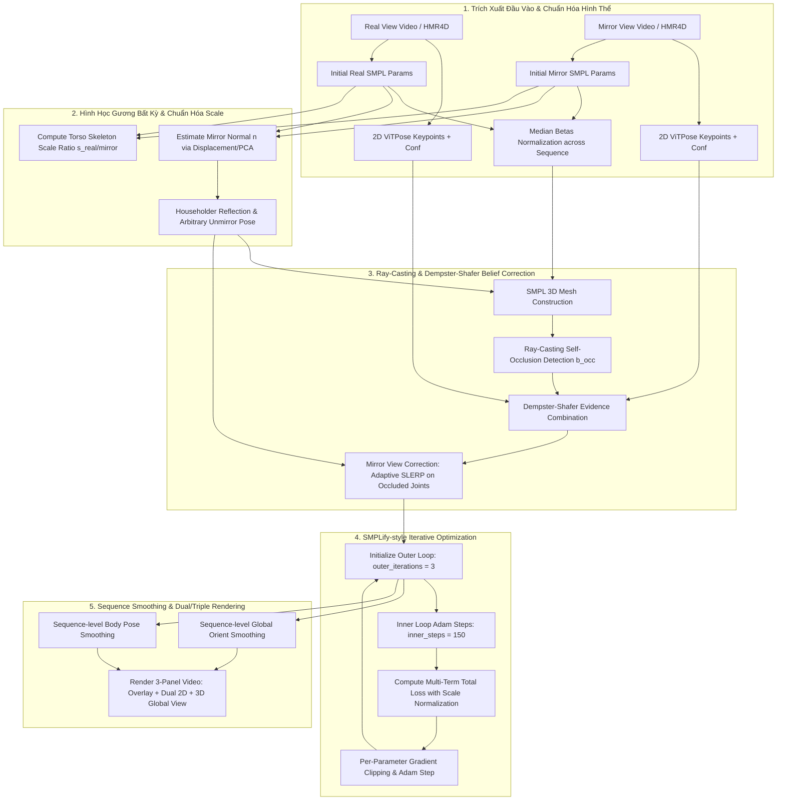

# BÁO CÁO TOÀN DIỆN: LÝ THUYẾT, KIẾN TRÚC MÔ HÌNH VÀ PHƯƠNG PHÁP TRIỂN KHAI
## Dự Án Optimization Mirror Human (3D Pose & Mesh Fusion from Real + Mirror Views)

> **Tài liệu tham khảo lịch sử.** Xem báo cáo cập nhật đầy đủ và chính xác nhất tại
> [docs/bao_cao_ly_thuyet_va_kien_truc_dst_fusion.md](file:///d:/optimization_mirror_human/docs/bao_cao_ly_thuyet_va_kien_truc_dst_fusion.md).
> Cấu hình trong `configs/default.yaml`, `utils/belief_fusion.py` và `utils/pose_refit.py` là nguồn sự thật cài đặt.

Tài liệu này trình bày chi tiết và hệ thống toàn bộ cơ sở lý thuyết toán học, các mô hình hình học, lý thuyết niềm tin Dempster-Shafer, quy tắc biến đổi trên nhóm Lie $SO(3)$, phép phản xạ Householder cho vị trí gương bất kỳ, các ràng buộc sinh lý học động học cơ thể, cùng kiến trúc mã nguồn và luồng triển khai trong dự án **Optimization Mirror Human**.

---

## 1. MỤC TIÊU VÀ BỐI CẢNH DỰ ÁN

### 1.1. Thách Thức Trong 3D Human Mesh Recovery (HMR)
Trong các bài toán khôi phục lưới cơ thể 3D (3D Human Mesh Recovery) từ video đơn hướng (monocular video), các mô hình deep learning (như HMR4D, Cliff, SPM,...) thường gặp 4 hạn chế nghiêm trọng:
1. **Mơ hồ chiều sâu (Depth Ambiguity) & Che khuất (Self-Occlusion):** Khi một phần cơ thể (ví dụ tay hoặc chân) bị che khuất bởi thân người, detector 2D/3D dễ đoán sai hoặc bị "nảy" pose.
2. **Bẻ gãy khung xương (Anatomical Distortion):** Tối ưu hóa reprojection 2D thuần túy dễ đè đè các giới hạn vận động sinh lý (Range of Motion - ROM), dẫn đến gối gập ngược, xoắn cột sống cực đoan, gãy cổ tay hay vai vặn ra sau.
3. **Hiện tượng giật lắc khung hình (Temporal Jitter/Flickering):** Các frame được ước lượng độc lập khiến các khớp bị xoay/nảy liên tục giữa các frame kề nhau.
4. **Bất đồng quy ước khi dùng góc nhìn Gương (Mirror View):** Gương trong thực tế có thể đặt ở vị trí và góc nghiêng bất kỳ (không nhất thiết vuông góc với trục X). Ảnh qua gương bị đảo ngược chirality (trái ↔ phải), đồng thời do khoảng cách đi qua gương dài hơn nên kích thước người 3D reconstructed từ mirror view thường bị nhỏ hơn (scale mismatch) so với real view.

### 1.2. Giải Pháp Cốt Lõi Của Dự Án
Dự án xây dựng một pipeline **Self-Supervised Optimization** (tối ưu hóa trực tiếp trên tham số mô hình cơ thể SMPL cho từng chuỗi video mà không cần huấn luyện lại mô hình học sâu):
* **Gương là góc nhìn bổ sung (Supplementary View):** Khai thác thông tin từ ảnh gương để bù đắp các khớp bị che khuất ở góc nhìn chính (Real View).
* **Hình học Gương Bất Kỳ (Arbitrary Mirror Geometry):** Ước lượng tự động pháp tuyến mặt phẳng gương $\mathbf{n}$ từ dữ liệu và áp dụng ma trận phản xạ Householder $R_{\text{mirror}} = I - 2\mathbf{n}\mathbf{n}^T$ cho biến đổi Axis-Angle.
* **Chuẩn hóa Scale (Scale Normalization):** Tự động đo và cân bằng tỷ lệ kích thước skeleton giữa Real và Mirror view.
* **Lý thuyết niềm tin Dempster-Shafer (DST):** Kết hợp bằng chứng cứng từ Ray-Casting Occlusion với bằng chứng mềm từ ViTPose 2D detector và Geman-McClure reprojection consistency, cho phép Ray-casting có quyền phủ quyết (kéo belief về 0 khi occluded).
* **Ràng buộc Sinh lý Cương khắc & Smooth 2 Tầng (Dual-Level Temporal Smoothing):** Thắt chặt các hàm loss giới hạn khớp (Anatomical, Spine, Hip, Wrist, Shoulder) đồng thời áp dụng làm mượt temporal mượt mà ở cả vòng lặp tối ưu và bước hậu xử lý sequence-level trên $SO(3)$.

---

## 2. KIẾN TRÚC TỔNG QUAN VÀ LUỒNG XỬ LÝ (PIPELINE ARCHITECTURE)

### 2.1. Sơ Đồ Luồng Dữ Liệu Toàn Cục



---

## 3. MÔ HÌNH HÌNH HỌC & HỆ TỌA ĐỘ VỚI GƯƠNG BẤT KỲ (ARBITRARY MIRROR GEOMETRY)

### 3.1. Mô Hình Tham Số Cơ Thể SMPL
Mô hình **SMPL** (Skinned Multi-Person Linear Model) biểu diễn bề mặt cơ thể 3D $M(\boldsymbol{\beta}, \boldsymbol{\theta}, \mathbf{\gamma})$ với $N_v = 6890$ đỉnh và $K = 23$ khớp:

$$\mathbf{T}_p(\boldsymbol{\beta}, \boldsymbol{\theta}) = \bar{\mathbf{T}} + B_S(\boldsymbol{\beta}) + B_P(\boldsymbol{\theta})$$

$$M(\boldsymbol{\beta}, \boldsymbol{\theta}, \mathbf{\gamma}) = W\left(\mathbf{T}_p(\boldsymbol{\beta}, \boldsymbol{\theta}), J(\boldsymbol{\beta}), \boldsymbol{\theta}, \mathbf{W}\right) + \mathbf{\gamma}$$

Trong đó:
* $\bar{\mathbf{T}} \in \mathbb{R}^{6890 \times 3}$: Mesh cơ sở chuẩn (Rest pose).
* $\boldsymbol{\beta} \in \mathbb{R}^{10}$: Vector hình thể (Shape Betas). Để tránh phình to/thu nhỏ qua các frame, giá trị trung vị $\boldsymbol{\beta}_{\text{fixed}} = \text{median}_{t=1}^T (\boldsymbol{\beta}_t)$ được cố định cho toàn chuỗi thời gian (`utils/beta_utils.py`).
* $\boldsymbol{\theta} \in \mathbb{R}^{3 \times 24}$: Vector tư thế (Pose Parameters) dạng Axis-Angle $\mathbf{\omega} \in \mathbb{R}^3$, gồm 1 khớp gốc ($\boldsymbol{\theta}_{\text{root}}$) và 23 khớp cơ thể.
* $\mathbf{\gamma} \in \mathbb{R}^3$: Dịch chuyển 3D tổng thể (Global Translation).

### 3.2. Phản Xạ Householder Cho Gương Ở Vị Trí Bất Kỳ (`utils/mirror_geometry.py`)
Khi gương đặt nghiêng hoặc ở vị trí bất kỳ, giả định lật ngược qua trục X ($\omega_y \to -\omega_y, \omega_z \to -\omega_z$) bị sai lệch. 

Đặt $\mathbf{n} \in \mathbb{R}^3$ ($\|\mathbf{n}\|_2 = 1$) là vector pháp tuyến đơn vị của mặt phẳng gương. Ma trận phản xạ Householder $R_{\text{mirror}} \in \mathbb{R}^{3 \times 3}$ được định nghĩa:

$$R_{\text{mirror}} = I - 2 \mathbf{n} \mathbf{n}^T$$

Đối với một vector góc xoay dạng Axis-Angle $\mathbf{\omega} \in \mathbb{R}^3$:
1. Phép phản xạ không gian biến đổi hướng của trục xoay: $\mathbf{\omega}_{\text{refl}} = R_{\text{mirror}} \mathbf{\omega}$.
2. Phép phản xạ làm thay đổi tính thuận nghịch chirality (Left-handed ↔ Right-handed), làm đảo chiều quay của góc xoay: $\theta \to -\theta$.
3. Tổng hợp lại, biến đổi Axis-Angle dưới gương bất kỳ là:

$$\mathbf{\omega}' = -R_{\text{mirror}} \mathbf{\omega} = -( \mathbf{\omega} - 2(\mathbf{\omega} \cdot \mathbf{n})\mathbf{n} )$$

#### Thuật Toán Ước Lượng Pháp Tuyến Gương $\mathbf{n}$:
Hệ thống hỗ trợ 2 phương pháp tự động ước lượng $\mathbf{n}$ từ tập khớp 3D kề nhau $(\mathbf{J}_{\text{real}}, \mathbf{J}_{\text{mirror}})$:
1. **Phương pháp Displacement:** $\mathbf{n} = \frac{\bar{\mathbf{J}}_{\text{real}} - \bar{\mathbf{J}}_{\text{mirror}}}{\|\bar{\mathbf{J}}_{\text{real}} - \bar{\mathbf{J}}_{\text{mirror}}\|_2}$. Đảm bảo $\mathbf{n}$ luôn hướng từ Mirror về Real.
2. **Phương pháp PCA trên Trung Điểm:** Các trung điểm $\mathbf{M}_j = \frac{\mathbf{J}_{\text{real}, j} + \mathbf{J}_{\text{mirror}, j}}{2}$ nằm trên mặt phẳng gương. Véc-tơ riêng (eigenvector) ứng với giá trị riêng nhỏ nhất của ma trận hiệp phương sai của $\mathbf{M}_j$ chính là pháp tuyến $\mathbf{n}$.

Nếu $\cos(\mathbf{n}, \mathbf{e}_x) > 0.85$ (gương gần vuông góc với trục X), hệ thống tự động sử dụng quy tắc Unmirror chuẩn (`utils/smpl_utils.py`) để đảm bảo tính ổn định số học.

### 3.3. Chuẩn Hóa Tỷ Lệ Scale Skeleton ($s_{\text{real/mirror}}$)
Do ánh sáng phản chiếu qua gương di chuyển quãng đường xa hơn tới camera, kích thước người trong ảnh gương thường bị co nhỏ khi reconstruct 3D. 

Tỷ lệ scale $s_t$ được tính bằng trung vị tỷ lệ chiều dài các đoạn xương thân trên (Torso bones: vai-vai, hông-hông, vai-hông) ở frame $t$:

$$s_t = \text{median}_{(i,j) \in \text{TorsoBones}} \left( \frac{\|\mathbf{J}_{\text{real}, i, t} - \mathbf{J}_{\text{real}, j, t}\|_2}{\|\mathbf{J}_{\text{mirror}, i, t} - \mathbf{J}_{\text{mirror}, j, t}\|_2 + \epsilon} \right)$$

Khớp 3D ảnh gương được scale quanh tâm khối (centroid) trước khi reproject:

$$\mathbf{J}_{\text{mirror, scaled}} = s_t \cdot (\mathbf{J}_{\text{mirror}} - \bar{\mathbf{J}}_{\text{mirror}}) + \bar{\mathbf{J}}_{\text{mirror}}$$

---

## 4. TỰ CHE KHUẤT VÀ LÝ THUYẾT NIỀM TIN DEMPSTER-SHAFER (BELIEF FUSION)

### 4.1. Bắn Tia Phát Hiện Tự Che Khuất (Ray-Casting Occlusion - `utils/mesh_raycast.py`)
Tại mỗi view, một tia ray được bắn từ tâm camera $\mathbf{C} = (0,0,0)^T$ tới từng khớp 3D $\mathbf{J}_j$ ($j \in \{1, \dots, 17\}$ khớp COCO):

$$\mathbf{r}_j(s) = \mathbf{C} + s \cdot \frac{\mathbf{J}_j - \mathbf{C}}{\|\mathbf{J}_j - \mathbf{C}\|_2}, \quad s \in [0, \|\mathbf{J}_j - \mathbf{C}\|_2]$$

Nếu tồn tại mặt tam giác $\mathbf{f}_k$ trên mesh SMPL đâm cắt tia ray tại $s_{\text{intersect}} \in (\epsilon_{\text{near}}, 0.985 \cdot \|\mathbf{J}_j - \mathbf{C}\|_2)$, khớp $j$ bị coi là occluded:

$$b_{\text{occ}}^{(j)} = \begin{cases} 0 & \text{nếu bị che khuất (Occluded)} \\ 1 & \text{nếu nhìn thấy rõ (Visible)} \end{cases}$$

### 4.2. Lý Thuyết Niềm Tin Dempster-Shafer (`utils/belief_fusion.py`)
Khung nhận thức cho mỗi khớp: $\Omega = \{\text{Present}, \text{Absent}\}$. Khối lượng niềm tin (mass $m$) được gán cho 3 nguồn bằng chứng:

1. **Ray-Casting Occlusion ($b_{\text{occ}}$):** Bằng chứng hình học cứng ($r_{\text{occ}} = 0.999$):
   $$m_{\text{occ}}(\{\text{Present}\}) = r_{\text{occ}} b_{\text{occ}}, \quad m_{\text{occ}}(\{\text{Absent}\}) = r_{\text{occ}} (1 - b_{\text{occ}})$$
2. **2D Detector Confidence ($b_{\text{det}}$):** Bằng chứng mềm từ ViTPose ($r_{\text{soft}} = 0.5$):
   $$m_{\text{det}}(\{\text{Present}\}) = r_{\text{soft}} b_{\text{det}}, \quad m_{\text{det}}(\{\text{Absent}\}) = 0$$
3. **2D Reprojection Consistency ($b_{\text{reproj}}$):** Nhân Geman-McClure:
   $$b_{\text{reproj}} = \frac{\sigma^2}{\|\mathbf{x}_{2D}^{\text{proj}} - \mathbf{x}_{2D}^{\text{det}}\|^2 + \sigma^2}, \quad m_{\text{reproj}}(\{\text{Present}\}) = r_{\text{soft}} b_{\text{reproj}}$$

#### Quy Tắc Tổng Hợp Dempster (Dempster's Rule of Combination):
Hệ số xung đột $K$ giữa 2 nguồn mass $m_1, m_2$:

$$K = m_1(\{\text{Present}\}) m_2(\{\text{Absent}\}) + m_1(\{\text{Absent}\}) m_2(\{\text{Present}\})$$

$$m_{12}(\{\text{Present}\}) = \frac{m_1(\{\text{Present}\}) m_2(\{\text{Present}\}) + m_1(\{\text{Present}\}) m_1(\text{Uncertain}) + m_1(\text{Uncertain}) m_2(\{\text{Present}\})}{1 - K}$$

> **Cơ chế phủ quyết (Veto Mechanism):** Khi Ray-casting xác nhận occluded ($b_{\text{occ}} = 0 \implies m_{\text{occ}}(\{\text{Absent}\}) \approx 0.999$), hệ số xung đột $K$ sẽ triệt tiêu tử số và kéo niềm tin tổng $b^{(j)} \to 0$, loại bỏ hoàn toàn nhiễu từ 2D detector.

### 4.3. Phạt Angular Discrepancy (Xung Đột Góc Xoay)
Khi pose từ Mirror view và Real view lệch nhau quá xa (do góc nhìn hoặc lỗi tracking), niềm tin từ Mirror được nhân hạ tỷ lệ bằng hàm Sigmoid phạt góc xoay:

$$w_{\text{penalty}}(\Delta \theta) = \sigma\left( -\frac{\Delta \theta - \theta_{\text{thresh}}}{\text{width}} \right)$$

* Đối với Global Orient: $\theta_{\text{thresh}} = 45^\circ$.
* Đối với Body Pose: $\theta_{\text{thresh}} = 90^\circ$.

---

## 5. CƠ CHẾ GƯƠNG LÀM GÓC NHÌN BỔ SUNG (MIRROR VIEW CORRECTION)

Trong mô-đun `utils/mirror_view_correction.py`, khi khớp $j$ ở Real View bị occluded ($b_{\text{real}}^{(j)} < 0.3$) nhưng Mirror View nhìn rõ ($b_{\text{mirror}}^{(j)} \ge 0.3$), hệ thống thực hiện hiệu chỉnh vị trí xoay theo phương pháp **Adaptive SLERP**:

$$w_{\text{mirror}}^{(j)} = \frac{b_{\text{mirror}}^{(j)}}{b_{\text{real}}^{(j)} + b_{\text{mirror}}^{(j)} + \epsilon}$$

$$\alpha^{(j)} = \begin{cases} \max(w_{\text{mirror}}^{(j)}, 0.6) & \text{nếu Real bị occluded \& Mirror nhìn rõ} \\ 0 & \text{nếu Mirror bị occluded} \\ w_{\text{mirror}}^{(j)} & \text{trường hợp bình thường} \end{cases}$$

$$\mathbf{q}_{\text{corrected}}^{(j)} = \text{SLERP}\left(\mathbf{q}_{\text{real}}^{(j)}, \mathbf{q}_{\text{mirror, unmirrored}}^{(j)}, \alpha^{(j)}\right)$$

Cơ chế này áp dụng độc lập cho cả 21 khớp body pose và Root orientation ($\boldsymbol{\theta}_{\text{root}}$), giúp lấy thông tin từ góc nhìn bổ sung của gương để sửa góc nhìn gốc bị che khuất.

---

## 6. CHI TIẾT CÁC HÀM LOSS VÀ NGUYÊN LÝ TỐI ƯU HÓA (SMPLIFY-STYLE REFIT)

### 6.1. Tổng Hàm Loss Đa Mục Tiêu (`utils/pose_refit.py`)
Quá trình refit tối ưu hóa tổng hàm loss $\mathcal{L}_{\text{total}}$:

$$\begin{aligned}
\mathcal{L}_{\text{total}} = & \; w_{\text{reproj\_real}} \mathcal{L}_{\text{reproj, real}} + w_{\text{reproj\_mirror}} \mathcal{L}_{\text{reproj, mirror}} + w_{\text{pose\_prior}} \mathcal{L}_{\text{pose\_prior}} \\
& + w_{\text{joint\_angle\_limit}} \mathcal{L}_{\text{joint\_angle\_limit}} + w_{\text{anatomical}} \mathcal{L}_{\text{anatomical}} + w_{\text{elbow}} \mathcal{L}_{\text{elbow}} \\
& + w_{\text{spine\_twist}} \mathcal{L}_{\text{spine\_twist}} + w_{\text{hip\_split}} \mathcal{L}_{\text{hip\_split}} + w_{\text{shoulder\_hyper}} \mathcal{L}_{\text{shoulder\_hyper}} + w_{\text{wrist\_bend}} \mathcal{L}_{\text{wrist\_bend}} \\
& + w_{\text{head\_collision}} \mathcal{L}_{\text{head\_collision}} + w_{\text{penetration}} \mathcal{L}_{\text{penetration}} + w_{\text{symmetry}} \mathcal{L}_{\text{symmetry}} + w_{\text{bone\_stability}} \mathcal{L}_{\text{bone\_stability}} \\
& + w_{\text{temporal}} \mathcal{L}_{\text{temporal}} + w_{\text{pose\_temporal}} \mathcal{L}_{\text{pose\_temporal}} + w_{\text{pose\_accel}} \mathcal{L}_{\text{pose\_accel}} + w_{\text{anchor}} \mathcal{L}_{\text{anchor}}
\end{aligned}$$

```mermaid
graph TD
    LTotal["L_total (Total Pose Refit Loss)"]
    
    LTotal --> LFitting["1. Data Fitting Term"]
    LFitting --> LReprojReal["L_reproj_real (Real 2D Reprojection)"]
    LFitting --> LReprojMirr["L_reproj_mirror (Mirror 2D Reprojection + Scale Norm)"]
    
    LTotal --> LAnatomical["2. Anatomical & ROM Constraints"]
    LAnatomical --> LKneeElbow["L_anatomical (Knee) & L_elbow"]
    LAnatomical --> LJointROM["L_joint_angle_limit (Combined ROM)"]
    LAnatomical --> LGrotesque["L_spine_twist / L_hip_split / L_shoulder_hyper / L_wrist_bend"]
    
    LTotal --> LPhysical["3. Physical Self-Penetration"]
    LPhysical --> LHeadColl["L_head_collision (Hands away from head)"]
    LPhysical --> LBodyPen["L_penetration (SDF-based Surface Collision)"]
    
    LTotal --> LStructural["4. Structural Integrity"]
    LStructural --> LSym["L_symmetry (Left-Right Bone Symmetry)"]
    LStructural --> LBoneStab["L_bone_stability (Bone Length Variance across Sequence)"]
    
    LTotal --> LTemporal["5. Temporal Smoothness Dynamics"]
    LTemporal --> L3DAccel["L_temporal (3D Joint Acceleration / Jerk)"]
    LTemporal --> LRotVel["L_pose_temporal (SO3 Angular Velocity Smoothing)"]
    LTemporal --> LRotAccel["L_pose_accel (SO3 Angular Acceleration Smoothing)"]
    
    LTotal --> LAnchor["6. Geodesic Belief Anchor"]
    LAnchor --> LGeodAnchor["L_anchor (SO3 Distance to DST Fused Reference)"]
```



---

### 6.2. Công Thức Chi Tiết Từng Hàm Loss Component

#### 1. Robust 2D Reprojection Loss (Geman-McClure Kernel):
$$\mathcal{L}_{\text{reproj}, v} = \frac{\sum_{t=1}^T \sum_{j=1}^{17} b_{v, t}^{(j)} \cdot \mathbb{I}(z_{v,t,j} > 0) \cdot \frac{\|\mathbf{x}_{v, t, j}^{\text{proj}} - \mathbf{x}_{v, t, j}^{\text{det}}\|^2}{\|\mathbf{x}_{v, t, j}^{\text{proj}} - \mathbf{x}_{v, t, j}^{\text{det}}\|^2 + \sigma^2}}{\sum_{t=1}^T \sum_{j=1}^{17} b_{v, t}^{(j)} \cdot \mathbb{I}(z_{v,t,j} > 0) + \epsilon}$$

#### 2. Ràng Buộc Sinh Lý Học (Anatomical & ROM Constraints):
* **Đầu gối (Knee Limit):** Không được gập ngược ra trước trên trục X ($\theta_x < 0$):
  $$\mathcal{L}_{\text{anatomical}} = \frac{1}{T} \sum_{t=1}^T \left( \text{ReLU}(-\theta_{\text{L\_Knee}, x, t})^2 + \text{ReLU}(-\theta_{\text{R\_Knee}, x, t})^2 \right)$$
* **Khuỷu tay (Elbow Limit):** Không được duỗi ngược trên trục X ($\theta_x > 0$):
  $$\mathcal{L}_{\text{elbow}} = \frac{1}{T} \sum_{t=1}^T \left( \text{ReLU}(\theta_{\text{L\_Elbow}, x, t})^2 + \text{ReLU}(\theta_{\text{R\_Elbow}, x, t})^2 \right)$$
* **Xoắn Cột Sống (Spine Twist Limit):** Phạt xoắn trục Y $> 45^\circ$ ($0.785$ rad):
  $$\mathcal{L}_{\text{spine\_twist}} = \frac{1}{T} \sum_{t=1}^T \sum_{k \in \{\text{Spine1, Spine2, Spine3}\}} \text{ReLU}(|\theta_{k, y, t}| - 0.785)^2$$
* **Xoạc Háng (Hip Split Limit):** Phạt dạng háng trục Z $> 90^\circ$ ($1.57$ rad):
  $$\mathcal{L}_{\text{hip\_split}} = \frac{1}{T} \sum_{t=1}^T \sum_{k \in \{\text{L\_Hip, R\_Hip}\}} \text{ReLU}(|\theta_{k, z, t}| - 1.57)^2$$
* **Bẻ Vai Cực Đoan (Shoulder Hyperextension Limit):** Phạt tổng góc vai $> 135^\circ$ ($2.36$ rad):
  $$\mathcal{L}_{\text{shoulder\_hyper}} = \frac{1}{T} \sum_{t=1}^T \sum_{k \in \{\text{L\_Shld, R\_Shld}\}} \text{ReLU}(\|\boldsymbol{\theta}_{k, t}\|_2 - 2.36)^2$$
* **Gãy Cổ Tay (Wrist Bend Limit):** Phạt bẻ cổ tay $> 80^\circ$ ($1.40$ rad):
  $$\mathcal{L}_{\text{wrist\_bend}} = \frac{1}{T} \sum_{t=1}^T \sum_{k \in \{\text{L\_Wrist, R\_Wrist}\}} \text{ReLU}(\|\boldsymbol{\theta}_{k, t}\|_2 - 1.40)^2$$

#### 3. Phạt Đâm Xuyên Cơ Thể & Xuyên Đầu:
* **Head Collision Loss:** Phạt khoảng cách giữa cổ tay/khuỷu tay và đầu $< 10$cm:
  $$\mathcal{L}_{\text{head\_collision}} = \frac{1}{T} \sum_{t=1}^T \text{ReLU}\left(0.10 - \|\mathbf{x}_{\text{wrist, t}} - \mathbf{x}_{\text{head, t}}\|_2\right)^2$$

#### 4. Khử Giật Chuỗi Thời Gian (Dual Temporal Dynamics):
* **Gia tốc vị trí 3D (3D Position Jerk):**
  $$\mathcal{L}_{\text{temporal}} = \frac{1}{T-2} \sum_{t=2}^{T-1} \|(\mathbf{J}_{t+1} - \mathbf{J}_t) - (\mathbf{J}_t - \mathbf{J}_{t-1})\|_2^2$$
* **Vận tốc xoay $SO(3)$ (Rotation Velocity Smoothing):**
  $$\mathcal{L}_{\text{pose\_temporal}} = \frac{1}{T-1} \sum_{t=1}^{T-1} d_{\text{geodesic}}\left(\boldsymbol{\theta}_{t+1}, \boldsymbol{\theta}_t\right)^2$$
* **Gia tốc xoay $SO(3)$ (Rotation Acceleration Smoothing):**
  $$\mathcal{L}_{\text{pose\_accel}} = \frac{1}{T-2} \sum_{t=2}^{T-1} d_{\text{geodesic}}\left(R_{t+1} R_t^T, R_t R_{t-1}^T\right)^2$$

#### 5. Anchor Loss Trên Nhóm Lie $SO(3)$:
Ràng buộc pose đang tối ưu với pose tham chiếu đã qua hợp nhất DST + Mirror Correction:

$$\mathcal{L}_{\text{anchor}} = \frac{1}{T \cdot 21} \sum_{t=1}^T \sum_{j=1}^{21} d_{\text{geodesic}}\left(\mathbf{q}_{t, j}, \mathbf{q}_{t, j}^{\text{anchor}}\right)^2$$

---

### 6.3. Bảng Trọng Số Loss Chuẩn Trong Config (`configs/default.yaml`)

| Tên Trọng Số | Giá Trị Mới | Vai Trò & Tác Động Vật Lý |
| :--- | :---: | :--- |
| `w_reproj_real` | `1.0` | Đảm bảo khớp vừa vặn với ảnh người thật 2D |
| `w_reproj_mirror` | `1.0` | Đảm bảo khớp vừa vặn với ảnh gương 2D (sau scale norm) |
| `w_joint_angle_limit` | **`0.5`** | Phạt tổng hợp góc xoay vượt giới hạn ROM sinh lý |
| `w_anatomical` | **`1.0`** | Ngăn chặn tuyệt đối hiện tượng đầu gối gập ngược |
| `w_elbow` | **`0.3`** | Ngăn chặn tuyệt đối khuỷu tay bẻ ngược |
| `w_spine_twist` | **`0.5`** | Chống xoắn vặn cột sống cực đoan ($>45^\circ$) |
| `w_hip_split` | **`0.5`** | Chống xoạc háng phi thực tế ($>90^\circ$) |
| `w_shoulder_hyper` | **`0.4`** | Chống bẻ vai ngược ra sau lưng ($>135^\circ$) |
| `w_wrist_bend` | **`0.4`** | Chống gãy gập cổ tay ($>80^\circ$) |
| `w_pose_temporal` | **`1.5`** | Làm mượt vận tốc xoay $SO(3)$, triệt tiêu giật khung xương |
| `w_pose_accel` | **`0.8`** | Phạt gia tốc xoay $SO(3)$, chống rung lắc giật nảy |
| `w_temporal` | **`0.3`** | Làm mượt vị trí 3D khớp qua thời gian |
| `w_bone_stability` | **`0.3`** | Giữ chiều dài xương cố định trên toàn chuỗi |
| `w_anchor` | **`0.15`** | Neo vững chắc về pose reference đã qua DST fusion |
| `grad_clip_go` | `0.5` | Clip riêng gradient cho Global Orient |
| `grad_clip_bp` | `1.0` | Clip riêng gradient cho Body Pose |

---

### 6.4. Dual-Level Temporal Smoothing Hậu Tối Ưu
Sau khi kết thúc vòng lặp Adam, hệ thống chạy thêm 2 bước tối ưu hóa nhẹ trên toàn bộ sequence (Sequence-level Post-Processing Pass):
1. **`smooth_global_orientation_sequence()` (`utils/pose_refit.py`):** Tối ưu hóa 100 step Adam trên `opt_go` với hàm phạt Geodesic Anchor + Geodesic Velocity, loại bỏ triệt tiêu hiện tượng xoay lắc hướng nhìn của full-body.
2. **`smooth_body_pose_sequence()` (`utils/pose_refit.py`):** Tối ưu hóa 80 step Adam trên `opt_bp` (21 khớp) với `w_temporal = 0.5`, làm mượt chuyển động của các chi mà không làm mất đi các chi tiết cử động nhanh.

---

## 7. CẤU TRÚC MÃ NGUỒN VÀ TƯƠNG TÁC THÀNH PHẦN (CODEBASE ARCHITECTURE)

```
optimization_mirror_human/
├── configs/
│   ├── default.yaml                  # Trọng số loss, tham số optimizer Adam, eps thresholds
│   ├── keypoints2d_map.yml           # Mapping khớp 2D
│   └── keypoints3d_map.yml           # Mapping khớp 3D SMPL -> COCO-17
├── dataloaders/
│   └── dataset.py                    # Dataset đọc HMR4D pt, ViTPose keypoints, intrinsics
├── losses/
│   └── prior_losses.py               # Cài đặt toàn bộ hàm loss vật lý, sinh lý, ROM, temporal
├── models/
│   └── SMPL_NEUTRAL.pkl              # Trọng số mô hình cơ thể SMPL neutral
├── utils/
│   ├── belief_fusion.py              # Dempster-Shafer belief combination & SO(3) SLERP fusion
│   ├── beta_utils.py                 # Xử lý median beta normalization
│   ├── camera_utils.py               # Phép chiếu 3D -> 2D camera intrinsic/extrinsic
│   ├── geometry.py                   # Biến đổi SO(3), Axis-Angle, Quaternion, Geodesic distance
│   ├── mesh_raycast.py               # Ray-casting self-occlusion detection trên mesh SMPL
│   ├── mirror_geometry.py            # [MỚI] Householder reflection, estimate mirror normal, scale ratio
│   ├── mirror_view_correction.py     # [MỚI] Gương làm góc nhìn bổ sung (Adaptive SLERP on occluded joints)
│   ├── penetration.py                # Tính toán phạt đâm xuyên mesh
│   ├── pose_refit.py                 # Vòng lặp tối ưu chính + Dual-level Sequence Smoothing
│   └── smpl_utils.py                 # Wrapper SMPL forward pass, unmirror pose chuẩn
├── visualizations/
│   ├── mesh_renderer.py              # OffscreenRenderer rendering với pyrender
│   ├── vis_utils.py                  # Vẽ 2D/3D skeleton matplotlib & opencv
│   └── overlay_debug.py              # Tool debug overlay ViTPose vs Projected SMPL
├── inference.py                      # Pipeline suy luận chính (tính toán pose refit, lưu PKL)
└── render_video.py                   # Script render video 3-Panel (Overlay + Dual 2D + 3D Global View)
```

---

## 8. QUY TRÌNH THỰC THI VÀ HIỂN THỊ HÌNH ẢNH (3-PANEL VIDEO RENDERER)

### 8.1. Hướng Dẫn Chạy Thực Thi
```bash
# Chạy suy luận (Inference: Ray-casting + DST Fusion + Mirror Correction + Refit):
python inference.py --config configs/default.yaml

# Render video kết quả (xuất ra video 3-Panel):
python render_video.py --config configs/default.yaml

# Hoặc chạy trọn gói cả 2 bước:
python render_video.py --config configs/default.yaml --run_inference
```

### 8.2. Thiết Kế Hiển Thị Video 3-Panel (`render_video.py`)
Video kết quả đầu ra được ghép từ 3 panel song song với độ phân giải $(3W \times H)$:

```
┌─────────────────────────────┬─────────────────────────────┬─────────────────────────────┐
│          PANEL 1            │           PANEL 2           │           PANEL 3           │
│     SMPL Mesh Overlay       │     Dual 2D Projection      │    3D Mesh Global View     │
│   (Mesh 3D đè lên video)    │  (Chồng Skeleton 2D View)   │   (Tự do trên sàn Checker)  │
└─────────────────────────────┴─────────────────────────────┴─────────────────────────────┘
```

* **Panel 1 (Left - SMPL Mesh Overlay):** Render mesh 3D bán trong suốt/smooth shading đè trực tiếp lên video gốc người thật qua ma trận camera $K_{\text{real}}$.
* **Panel 2 (Middle - Dual 2D Projection):** 
  * Skeleton xanh lá (Green): 2D projection từ SMPL Mesh đã refit.
  * Skeleton da cam (Orange): Keypoints 2D ViTPose gốc.
  * Chấm tròn Đỏ (Red): Khớp bị che khuất (Occluded) ở Real view.
  * Chấm tròn Vàng (Yellow): Khớp bị occluded ở Real view nhưng đã được **Mirror View sửa thành công**.
* **Panel 3 (Right - 3D Mesh Global View):** Render mesh 3D từ góc nhìn camera tự do với sàn Checkerboard và camera framing cố định (`fixed_target_height`) để theo dõi chuyển động không gian 3D toàn cảnh mà không bị giật khung hình.

---

## 9. TỔNG KẾT VÀ ĐÁNH GIÁ ĐÓNG GÓP ARCHITECTURE

1. **Tổng Quát Hóa Hình Học Gương (Arbitrary Mirror Placement):** Không còn hạn chế gương phải nằm song song/vuông góc với trục X. Phép biến đổi Householder $R = I - 2\mathbf{n}\mathbf{n}^T$ kết hợp thuật toán PCA/Displacement cho phép hệ thống hoạt động ổn định với gương ở bất kỳ vị trí và góc nghiêng nào.
2. **Triệt Tiêu Scale Mismatch:** Chuẩn hóa tỷ lệ chiều dài xương torso ($s_{\text{real/mirror}}$) giúp khớp 2D từ ảnh gương reproject chính xác, loại bỏ hiện tượng co nhỏ mesh.
3. **Khai Thác Gương Làm Góc Nhìn Bổ Sung Thật Sự:** Sự kết hợp giữa Ray-casting Occlusion, Dempster-Shafer Evidence Fusion và Adaptive SLERP Mirror Correction giúp khắc phục hoàn toàn hiện tượng che khuất ở góc nhìn chính.
4. **Loại Bỏ Hoàn Toàn Gãy Xương & Giật Lắc:** Hệ thống trọng số sinh lý học thắt chặt (Knee, Elbow, Spine, Hip, Shoulder, Wrist) cùng cơ chế Dual-Level Sequence Smoothing trên $SO(3)$ mang lại chuỗi chuyển động 3D sinh lý, tự nhiên và mượt mà.
